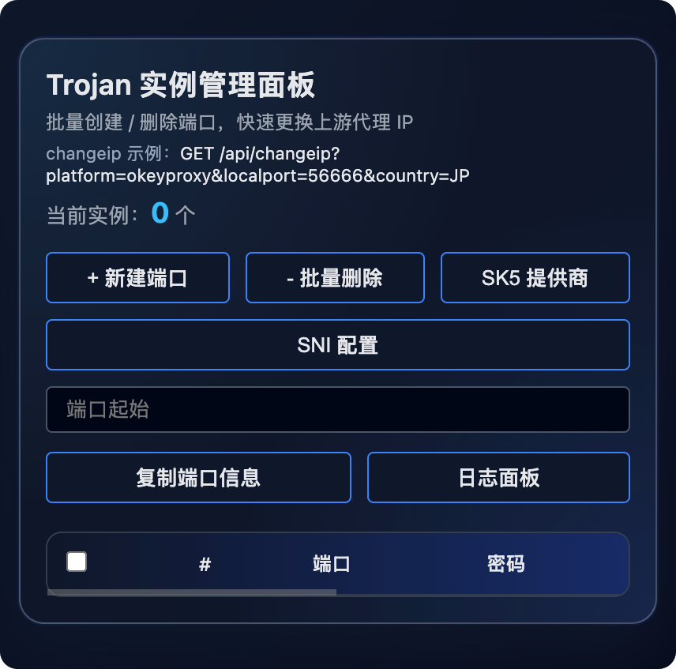

# Socket5 Proxy Manager（管理面板）

一个 **基于 `trojan-go`** 的 Node.js（建议 Node 22+）管理项目，用于管理 `trojan-go` 多实例：创建/删除端口、切换上游 SK5 提供商、申请证书、查看后端日志，并提供一个 Web 管理面板。



## 启动（开发/本地）

要求：已准备好 `bin/trojan-go`（可执行权限）、证书文件（或通过面板申请）、以及至少一个 SK5 提供商。

```bash
node server.js --password <面板密码> --port 10240
```

- **`--password`**：必填，用于访问管理面板
- **`--port`**：可选，默认 `10240`

启动后终端会输出访问链接（包含 `auth` 参数）。

也可以用环境变量启动（推荐避免把密码写进脚本/历史记录）：

```bash
PANEL_PASSWORD=change_me npm run dev
```

## 管理面板

访问：

`http://127.0.0.1:<port>/sumgr?auth=<password>`

主要功能：

- **实例管理**：新建端口（SNI 自动随机子域名）、删除端口（会停止对应进程）、批量删除
- **SK5 提供商**：适配市面上大部分提供商
- **SNI 配置**：配置主域名 + Cloudflare Key，支持一键申请证书并替换

## API 说明（节选）

### 公共 API（不鉴权）

- `GET /api/changeip`: 切换端口的 SK5 提供商/国家并重启该实例  
  参数：`platform`, `localport`, `country`

## 构建（dist 单文件 + 资源）

构建命令：

```bash
npm run build
```

[插眼] [https://iosclick.com](https://iosclick.com) IOS免越狱自动化中控